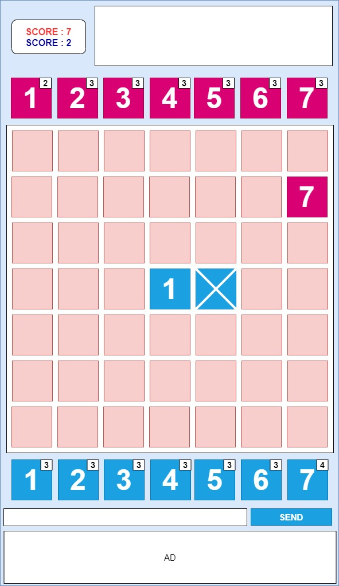

Toy project v.5 RULE 
---

### 게임명 : NUMBERS OTHELLO

## 게임 소개

두 명의 플레이어가 7x7 크기의 보드에 1부터 7까지의 숫자를 번갈아 놓으며 점수를 얻는 전략 보드게임입니다. 게임 종료 시 더 높은 점수를 획득한 플레이어가 승리합니다.

## 게임 흐름

1.  **방 입장**: 게임을 할 방에 두 명의 플레이어가 모두 입장합니다.
2.  **준비**: 두 플레이어가 모두 '레디' 버튼을 누릅니다.
3.  **게임 시작**: 게임이 시작되면 각 플레이어는 무작위로 23개의 숫자 카드를 받습니다. 선공은 항상 '플레이어 1(파란색)'입니다.
4.  **턴 진행**: 자신의 턴에, 가지고 있는 숫자 카드 중 하나를 선택한 후 보드의 빈칸에 놓습니다. 수를 놓으면 규칙에 따라 상대방의 돌을 뒤집을 수 있습니다.
5.  **게임 종료**: 아래 조건 중 하나가 만족되면 게임이 즉시 종료됩니다.
    *   보드의 49칸이 모두 채워졌을 때
    *   플레이어 중 한 명이라도 가진 숫자 카드를 모두 사용했을 때
6.  **승리**: 더 높은 점수를 획득한 플레이어가 승리합니다. 점수가 같으면 무승부입니다.

## 점수 계산

*   **내가 놓은 숫자**: 숫자 그대로 점수가 됩니다. (예: 7을 놓으면 7점)
*   **뒤집힌 돌**: 타입(POB, PTB)에 관계없이 개당 **1점**입니다.

## 게임 규칙

**0. 플레이어 패 (Hand)**
*   게임 시작 시, 각 플레이어는 총 **23개**의 숫자 카드를 무작위로 받습니다.
*   자신이 보유한 카드만 사용할 수 있으며, 한 번 사용한 카드는 사라집니다.
*   어떤 숫자를 몇 개 받을지는 아래 규칙에 따라 무작위로 결정됩니다.
    *   1, 2, 3, 4 카드는 각각 최대 4개까지 가질 수 있습니다.
    *   5, 6, 7 카드는 각각 최대 3개까지 가질 수 있습니다.

**1. '1' 사용 제한**
*   숫자 1은 연속으로 두 번 플레이할 수 없습니다.
*   **예외**: 자신의 패에 1만 남았거나, 1 이외의 다른 숫자가 모두 0개일 경우에는 연속으로 사용할 수 있습니다.

**2. 돌 뒤집기 규칙**
> 내가 숫자 **N**을 보드의 특정 칸에 놓았을 때, 그 칸을 둘러싼 주변 8칸(3x3 영역)을 확인하여 아래 조건 중 하나라도 만족하면, 그 8칸 안에 있던 **모든 돌**들이 나의 뒤집힌 돌로 변합니다.

*   **조건 A (개수 일치)**: 주변 8칸에 놓인 돌의 **개수**가 내가 낸 숫자 **N**과 정확히 일치할 경우.
*   **조건 B (합계 일치)**: 주변 8칸에 놓인 돌들의 **숫자 값의 합**이 내가 낸 숫자 **N**과 정확히 일치할 경우.

**3. 우선순위 (수정됨)**
*   `[기존 규칙]` 복잡한 연쇄 반응 규칙이 있었으나, 게임의 안정성과 명확성을 위해 단순화되었습니다.
*   `[현재 규칙]` 내가 돌을 놓았을 때 발생하는 효과(돌 뒤집기)만 즉시 적용됩니다. 그로 인한 추가적인 연쇄 반응은 일어나지 않습니다.

### 화면 디자인

